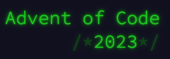

# Advent of Code 2023

My solutions to the [Advent of Code 2023](https://adventofcode.com/2023) puzzles. All of my solutions are developed using the [Python 3.10](https://www.python.org/downloads/release/python-3100/) version.

## Structure
Each day's solutions can be found in it's respective folder. For example, day 1 can be found in the [`day1`](/blob/main/day1) folder. Each task has its own respective python script, following a similar structure to the days.